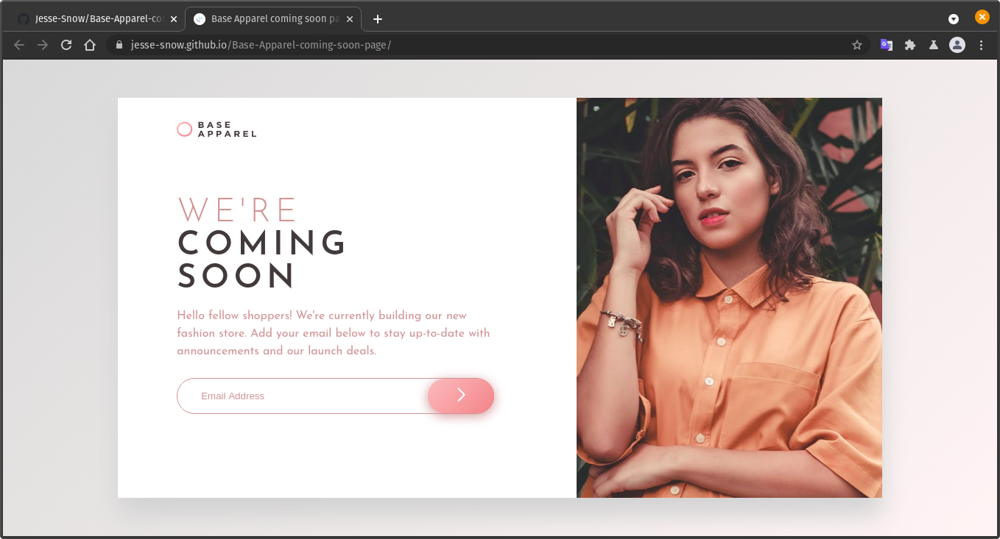

# Frontend Mentor - Base Apparel coming soon page solution

This is a solution to the [Base Apparel coming soon page challenge on Frontend Mentor](https://www.frontendmentor.io/challenges/base-apparel-coming-soon-page-5d46b47f8db8a7063f9331a0). Frontend Mentor challenges offer desings to be coded

## Table of contents

- [Overview](#overview)
  - [The challenge](#the-challenge)
  - [Screenshot](#screenshot)
  - [Links](#links)
- [My process](#my-process)
  - [Built with](#built-with)
  - [What I learned](#what-i-learned)
  - [Continued development](#continued-development)
- [Author](#author)

## Overview

### The challenge

Users should be able to:

- View the optimal layout for the site depending on their device's screen size
- See hover states for all interactive elements on the page
- Receive an error message when the `form` is submitted if:
  - The `input` field is empty
  - The email address is not formatted correctly

### Screenshot

### Links

- [Preview URL](https://jesse-snow.github.io/Base-Apparel-coming-soon-page/)
## My process

### Built with

- Semantic HTML5 markup
- CSS Flexbox
- Mobile first Workflow

### What I learned

- Do a mobile first workflow
- Ways to validate a FORM using JS
- What is ::before and ::after pseudo-elements

### Continued development

I want to learn more about SVG images.

## Author

- GitHub[Jesse-Snow](https://github.com/Jesse-Snow/)
